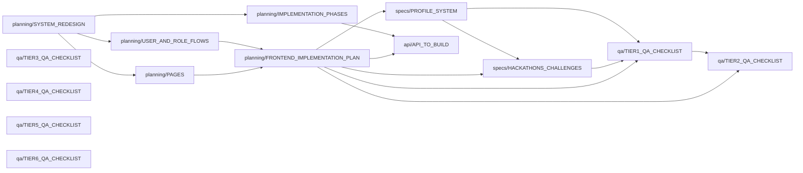

# Team1 Grants — Docs Index

Top-level navigator. One line per doc. If you're looking for something, start here —
then jump straight to the file instead of scanning each one.

When a doc is added, moved, deleted, or meaningfully updated, update its line here
**in the same commit**. See `feedback_docs_index_tracking.md` in project memory.

---

## Dependency graph

Who depends on who. Read left-to-right: a doc on the right assumes the doc on the left.



Rule of thumb: if you're new, read in this order:
`SYSTEM_REDESIGN` → `USER_AND_ROLE_FLOWS` → `PAGES` → `FRONTEND_IMPLEMENTATION_PLAN`.
Then dive into whichever spec matches your task.

---

## planning/ — roadmap, architecture, build order (5 files)

- [**SYSTEM_REDESIGN.md**](planning/SYSTEM_REDESIGN.md) — what the system is. Architecture, Prisma schema, access control model, APIs, security, performance. **Source of truth for the data model.** Reference; read once, consult on schema questions.
- [**USER_AND_ROLE_FLOWS.md**](planning/USER_AND_ROLE_FLOWS.md) — role × flow matrix. Who can do what, which pages each role sees, what modules exist inside Admin/Org roles. Consult when a new feature has "who can see X?" ambiguity.
- [**PAGES.md**](planning/PAGES.md) — master page list (50 pages) grouped by flow, with shipped checkboxes. **Source of truth for scope.** Tick when shipping.
- [**FRONTEND_IMPLEMENTATION_PLAN.md**](planning/FRONTEND_IMPLEMENTATION_PLAN.md) — living doc: Tier 1–4 tables with status per page, upcoming commits queue, shipped log per commit. **Update on every ship.** Companion to PAGES.md with more commit-level detail.
- [**IMPLEMENTATION_PHASES.md**](planning/IMPLEMENTATION_PHASES.md) — **backend** build order. 4 phases: foundation (Prisma + BuilderHub), upgrades, multi-tenant (orgs/grants/applications), polish. Complementary to FRONTEND_IMPLEMENTATION_PLAN (different axis).

## specs/ — feature-specific design docs (2 files)

- [**PROFILE_SYSTEM.md**](specs/PROFILE_SYSTEM.md) — applicant profile spec for `/u/[handle]`. Four view modes (public / self / admin / org-scoped), data helpers, integration points with projects + grants + competitions.
- [**HACKATHONS_CHALLENGES.md**](specs/HACKATHONS_CHALLENGES.md) — competitions spec. Data model (Competition / Track / Team / Submission), team flow states, visibility matrix (loose-private default), prize model, per-page behavior, 4a + 4b ship plan.

## design/ — visual design system (1 file)

- [**DESIGN_SYSTEM_PLAN.md**](design/DESIGN_SYSTEM_PLAN.md) — Complete design system specification. Hand this to any design AI or designer to generate the full UI kit + page designs. Covers: brand identity, color tokens, typography scale, spacing grid, all 11 existing components + 12 new ones needed, 6 page templates, interaction/motion spec, icon guidelines, and implementation path. **This is the bridge between the B&W scaffold and the real product design.**

## api/ — backend contract (1 file)

- [**API_TO_BUILD.md**](api/API_TO_BUILD.md) — backend work queue. Every endpoint the frontend needs and doesn't yet have, grouped by domain, with request/response shapes. **Update when adding new `// API:` comments in code.**

## qa/ — manual verification (6 files)

- [**TIER1_QA_CHECKLIST.md**](qa/TIER1_QA_CHECKLIST.md) — page-by-page manual walkthrough for Tier 1. Organized per-role, cross-page flows, edge cases, a11y spot-checks, known Tier 2+ gaps.
- [**TIER2_QA_CHECKLIST.md**](qa/TIER2_QA_CHECKLIST.md) — Tier 2 page-by-page walkthrough.
- [**TIER3_QA_CHECKLIST.md**](qa/TIER3_QA_CHECKLIST.md) — Tier 3 page-by-page walkthrough.
- [**TIER4_QA_CHECKLIST.md**](qa/TIER4_QA_CHECKLIST.md) — Tier 4 page-by-page walkthrough (platform admin + SSO callback).
- [**TIER5_QA_CHECKLIST.md**](qa/TIER5_QA_CHECKLIST.md) — Tier 5 page-by-page walkthrough (power-user: search, app versioning, reviewer dashboards, analytics, COI audit, cross-grants).
- [**TIER6_QA_CHECKLIST.md**](qa/TIER6_QA_CHECKLIST.md) — Tier 6 page-by-page walkthrough (ecosystem addons: digest, webhooks, API keys, embed widget, templates).

---

## Quick lookup

| Looking for… | Start here |
|---|---|
| "Is this page built yet?" | [planning/PAGES.md](planning/PAGES.md) |
| "What commit is shipping next?" | [planning/FRONTEND_IMPLEMENTATION_PLAN.md](planning/FRONTEND_IMPLEMENTATION_PLAN.md) |
| "What's the Prisma schema?" | [planning/SYSTEM_REDESIGN.md](planning/SYSTEM_REDESIGN.md) |
| "Who sees what page?" | [planning/USER_AND_ROLE_FLOWS.md](planning/USER_AND_ROLE_FLOWS.md) |
| "What's the backend build order?" | [planning/IMPLEMENTATION_PHASES.md](planning/IMPLEMENTATION_PHASES.md) |
| "What does the competition team flow look like?" | [specs/HACKATHONS_CHALLENGES.md](specs/HACKATHONS_CHALLENGES.md) |
| "What can an org viewer see on a profile page?" | [specs/PROFILE_SYSTEM.md](specs/PROFILE_SYSTEM.md) |
| "Which API endpoint does this mock call?" | [api/API_TO_BUILD.md](api/API_TO_BUILD.md) |
| "How do I test Tier 1 end-to-end?" | [qa/TIER1_QA_CHECKLIST.md](qa/TIER1_QA_CHECKLIST.md) |
| "How do I test a Tier 2 page I just shipped?" | [qa/TIER2_QA_CHECKLIST.md](qa/TIER2_QA_CHECKLIST.md) |
| "How do I test a Tier 3 page I just shipped?" | [qa/TIER3_QA_CHECKLIST.md](qa/TIER3_QA_CHECKLIST.md) |
| "How do I test a Tier 4 page I just shipped?" | [qa/TIER4_QA_CHECKLIST.md](qa/TIER4_QA_CHECKLIST.md) |
| "How do I test a Tier 5 page I just shipped?" | [qa/TIER5_QA_CHECKLIST.md](qa/TIER5_QA_CHECKLIST.md) |
| "How do I test a Tier 6 page I just shipped?" | [qa/TIER6_QA_CHECKLIST.md](qa/TIER6_QA_CHECKLIST.md) |

---

## Living vs frozen vs scoped

- **Living** — changes with every ship. `planning/PAGES.md`, `planning/FRONTEND_IMPLEMENTATION_PLAN.md`, `api/API_TO_BUILD.md`.
- **Frozen** — written once per spec, only revised when the spec itself is revised. `specs/*`, `planning/SYSTEM_REDESIGN.md`, `planning/IMPLEMENTATION_PHASES.md`, `planning/USER_AND_ROLE_FLOWS.md`.
- **Scoped** — tier or release-specific. `qa/TIER1_QA_CHECKLIST.md`. A new Tier gets a new checklist, old ones are archived not deleted.

---

## Header block convention

Every doc under `docs/` (except this INDEX) starts with a metadata block:

```markdown
# [Title]

> **Phase:** Tier 1 (shipped) · **Status:** living / frozen / scoped
>
> **Prerequisites** (read first, in order):
> - [relative/path.md] — one-line reason
>
> **Out of scope** (pointers, not content):
> - Thing you might expect here but isn't → [relative/path.md]
>
> **Also see:**
> - [relative/path.md] — why you might want this alongside
```

The header tells you if the doc applies to your task before you read the body.

---

## Removed (2026-04-16)

- `api/API_LIST.md`, `api/BACKEND_MAP.md`, `reference/FRONTEND_MAP.md` — all three documented the pre-redesign codebase (Better-Auth, Mongoose models, legacy routes). Every file they referenced was deleted in the foundation commit. Stale + actively misleading. Recover from git history if ever needed: `git show b17a485:docs/API_LIST.md` (and similar).
